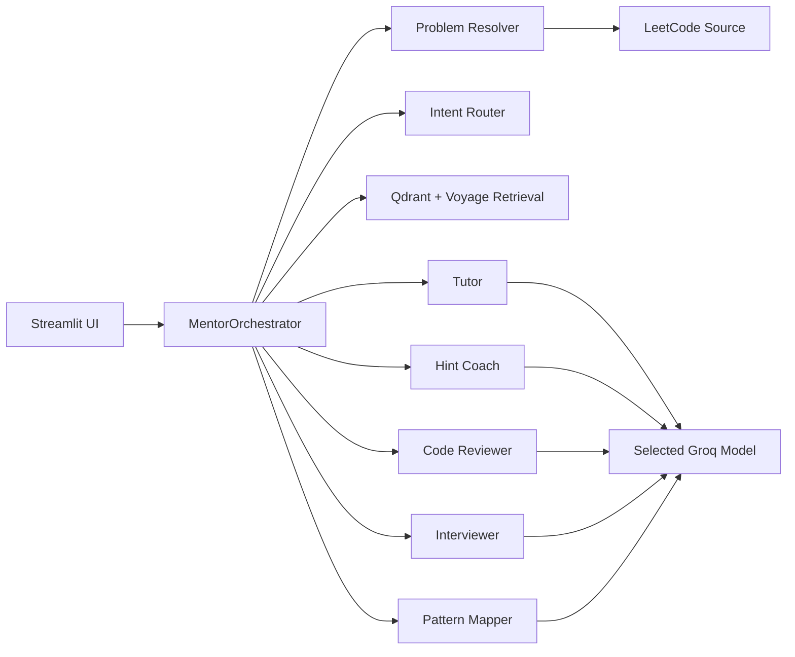

# Architecture

## Orchestration

`MentorOrchestrator` is the central LangGraph orchestrator. It coordinates deterministic
application services and specialist LLM agents without allowing uncontrolled agent-to-agent
loops.

## Request Flow

1. Problem Resolver detects a LeetCode URL, problem number, or pasted statement.
2. The LeetCode adapter loads title, statement, difficulty, and topic tags.
3. The intent router selects one specialist, unless the user explicitly selected a mode.
4. Retrieval loads relevant DSA knowledge.
5. The selected specialist uses the selected Groq model to answer.

## Package Boundaries

- `domain`: framework-independent entities and enums.
- `application`: use cases, ports, routing, problem resolution, and orchestration.
- `agents`: specialist prompts and Groq-backed agent registry.
- `infrastructure`: LeetCode, Qdrant, Voyage, and configuration adapters.
- `ui`: Streamlit presentation only.

## Important Trade-offs

LeetCode does not provide a supported public API. The adapter uses its public web GraphQL
endpoint and may need maintenance if LeetCode changes it. Pasted problem statements remain a
reliable fallback.

Voyage is hosted rather than open source. Replace it with BGE-M3/FastEmbed if fully self-hosted
embeddings are required.

For production, store the current problem, hint level, interview phase, learner profile, and
mastery events in PostgreSQL. Add a sandboxed code runner before executing user submissions.
